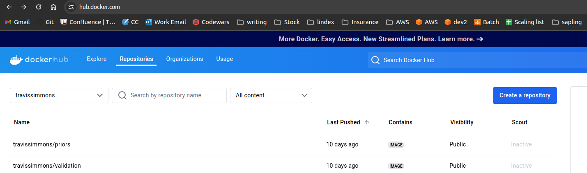

# Customizing a module, and then running on your HPC (it needs singularity of apptainer)

## Run the module locally using the 'Running a custom module locally' guide on this site.
If you are comfortable with docker, you can also just pull the repo and do docker build -t {your dockhub username}/{the module name} /the/repo/you/are/building

### Create a personal dockerhub account move your docker image between your local image
https://hub.docker.com/

### Create a dockerhub repo named the module

for example, for the priors module, my dockerhub repo link is travissimmons/priors

### upload your testd image to your dockerhub (run this step locally)

for example to upload my custom priors module:

''' 
sudo docker -t travissimmons/priors /your/priors/repo
docker push travissimmons/priors
'''

### Git clone the run-confluence-locally repo (on your hpc from here on out)

''' git Command here '''

Fill out and run run-confluence-locally/run_confluence_HPC.ipynb

This generates a bash script that can be submitted to a job scheduler

submit to a job scheduler